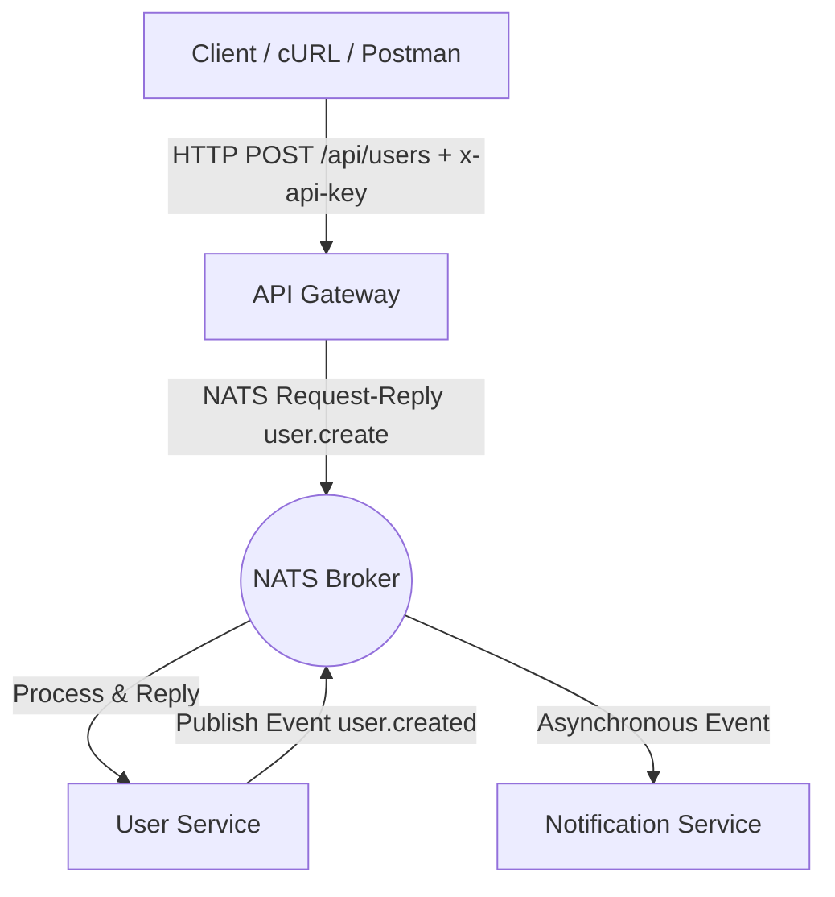

# Microservices System with API Gateway, NATS, and Node.js

This project is a light, event-driven microservices architecture built for the internship evaluation assignment. It demonstrates asynchronous inter-service communication using **NATS**, an **API Gateway** with header-based security, and isolated Docker containerization.

## Architecture Overview

   ### Components
API Gateway (Port 3000): Acts as the public entry point. Validates incoming requests using x-api-key header authentication and proxies commands to the internal NATS bus.

User Service: Consumes user.create requests, processes user creation logic, sends a synchronous response back to the Gateway, and publishes a decoupled user.created event.

Notification Service: Asynchronously listens to user.created events on NATS to trigger email/notification dispatch workflows.

NATS Message Broker (Port 4222): High-performance messaging system facilitating all inter-service communication without direct REST or WebSocket couplings.

Getting Started
Prerequisites
Docker Desktop installed and running.

Local Execution (One Command)
Clone the repository:

Bash
    git clone <your-github-repo-url>
    cd trams-assignment-intern
    Create .env file:

Bash
    cp .env.example .env
    Spin up all microservices and NATS broker:

Bash
    docker-compose up --build
    API Documentation
    Create User
    URL: http://localhost:3000/api/users

Method: POST

Headers:

Content-Type: application/json

x-api-key: my-super-secret-api-key

Body:

JSON
{
  "name": "Himanshu Jangra",
  "email": "himanshu@example.com"
}
Example Test Command (cURL)
Bash
curl -X POST http://localhost:3000/api/users \
  -H "Content-Type: application/json" \
  -H "x-api-key: my-super-secret-api-key" \
  -d '{"name": "Himanshu Jangra", "email": "himanshu@example.com"}'

---

Once you test with cURL and paste this `README.md`, you are **100% ready to push to GitHub and submit your assignment!**

<ElicitationsGroup message="Final steps:">
  <Elicitation label="Git push commands" query="Give me the exact git commands to commit and push all my files to my GitHub repo."/>
  <Elicitation label="Interview prep sheet" query="Give me a cheat sheet of bullet points to explain this architecture if they invite me for an interview."/>
</ElicitationsGroup>
